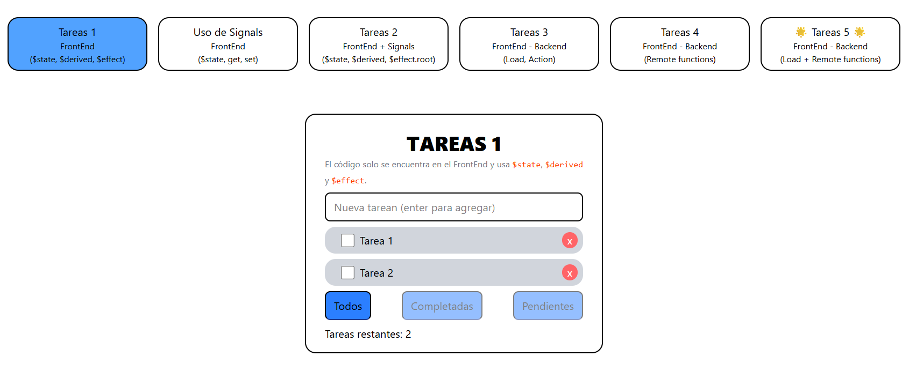
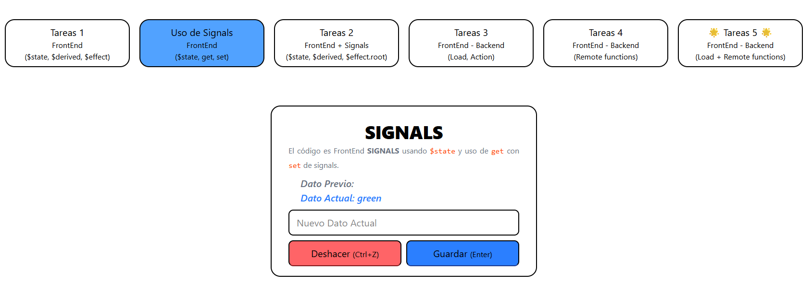
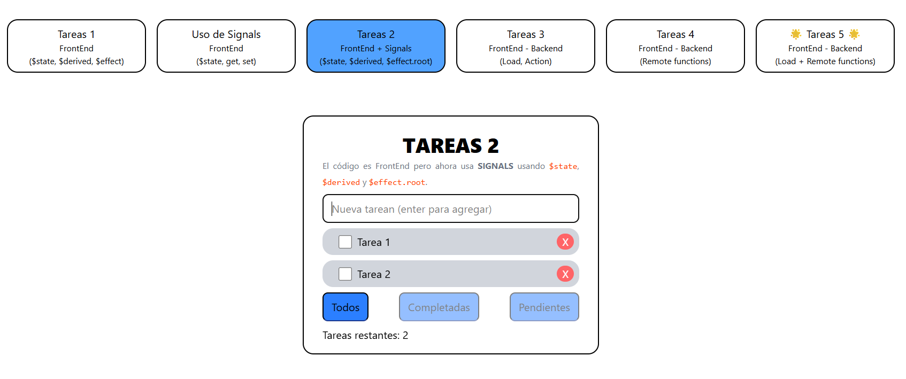
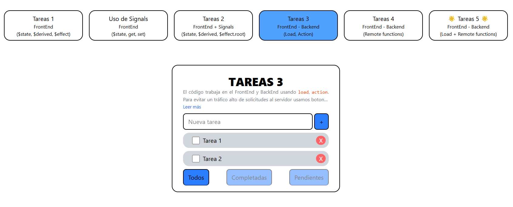
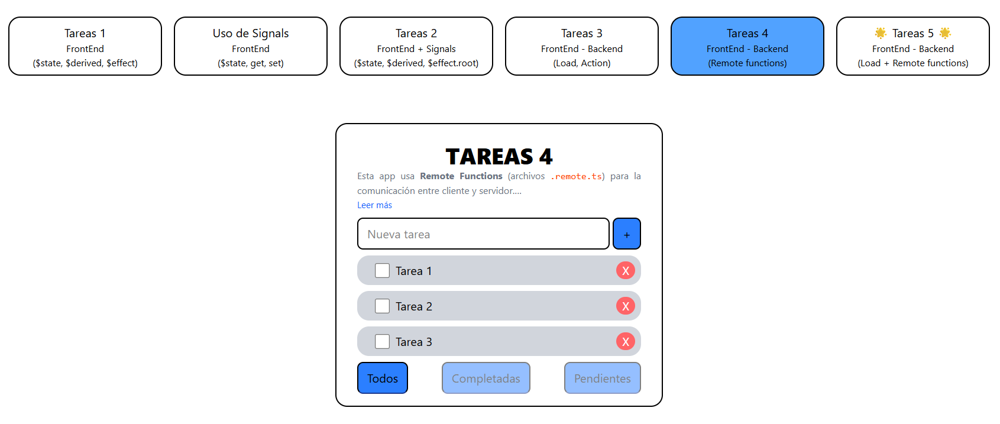
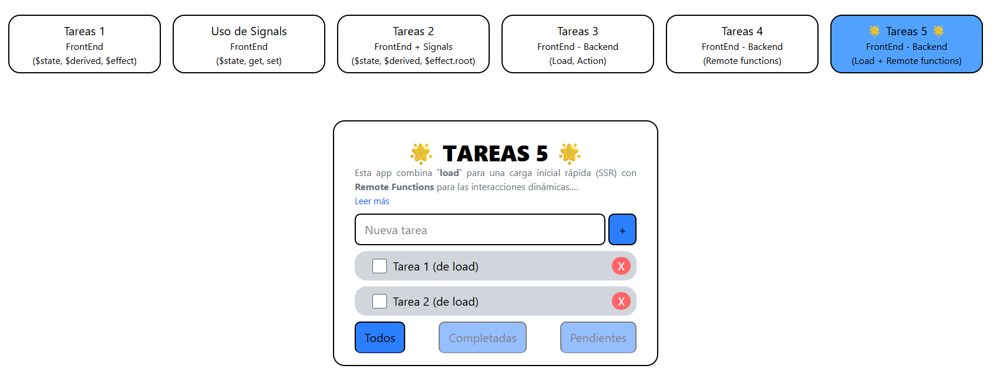

<a href='https://ko-fi.com/rubenmach' target='_blank'></a>

# Explorando SvelteKit: 6 Enfoques para el Manejo de Datos

Este repositorio es una demostración práctica que explora cinco arquitecturas diferentes para manejar el estado y los datos en una aplicación de lista de tareas (To-Do list) construida con SvelteKit y Svelte 5, utilizando las nuevas **Runas**.

Cada una de las cinco "demos" representa un enfoque distinto, desde una aplicación puramente frontend hasta una solución híbrida y optimizada que combina lo mejor del renderizado en el servidor y las interacciones dinámicas.

## Propósito del Proyecto

El objetivo es comparar y contrastar diferentes patrones de gestión de estado para entender sus ventajas, desventajas y casos de uso ideales. Este proyecto sirve como un recurso de aprendizaje para desarrolladores que están transicionando a Svelte 5 o que desean profundizar en las capacidades de SvelteKit.

---

## Las 5 Demos

A continuación se detalla cada una de las pruebas realizadas:

### 1. Tareas 1: Frontend Puro con Runas



Este es el enfoque más básico. Toda la lógica y el estado viven exclusivamente en el navegador.

* **Estado:** Gestionado con la runa `$state`.
* **Valores Calculados:** El filtrado de la lista y el conteo de tareas restantes se realizan con la runa `$derived`.
* **Persistencia:** Se utiliza la runa `$effect` para guardar y cargar las tareas desde el `localStorage` del navegador.
* **Ideal para:** Prototipos rápidos, aplicaciones sin conexión o componentes que no necesitan un backend.

### 2. Uso de Signals: Frontend con get y set



Este ejemplo ilustra el manejo manual y directo del estado utilizando las runas `$state`, `get` y `set`.

* **Estado ($state):** Se utiliza para declarar una variable reactiva.
* **Lectura (get):** Permite obtener el valor actual de un estado sin crear una suscripción.
* **Escritura (set):** Permite asignar un nuevo valor al estado.
* **Ideal para:** Implementar patrones como un historial de cambios (deshacer/rehacer) donde se necesita un control explícito sobre cuándo leer o escribir un valor.

### 3. Tareas 2: Frontend con "Signals" Externas



Este enfoque extrae la lógica de estado fuera del componente, creando una "signal" o "store" reutilizable, un patrón común para compartir estado entre múltiples componentes.

* **Estado Centralizado:** La lógica (`$state`, `$derived`, `$effect`) vive en un archivo `.svelte.ts`, demostrando cómo la reactividad de las runas ya no está limitada a los componentes.
* **Comunicación:** El componente importa y consume el estado reactivo, manteniendo la UI sincronizada.
* **Ideal para:** Gestionar estado global o compartido en el frontend de una manera organizada y escalable.

### 4. Tareas 3: Frontend + Backend (con `load` y `actions`)



Introduce la arquitectura clásica y robusta de SvelteKit, donde el servidor es la fuente de verdad.

* **Carga de Datos:** La función `load` en `+page.server.ts` obtiene los datos iniciales, permitiendo un renderizado en el servidor (SSR) rápido y amigable con el SEO.
* **Mutaciones de Datos:** Los `actions` del formulario manejan la creación, edición y eliminación de tareas. La UI se actualiza automáticamente gracias a la mejora progresiva (`use:enhance`).
* **Ideal para:** La mayoría de las aplicaciones web tradicionales. Es un patrón fiable, seguro y optimizado para el rendimiento.

### 5. Tareas 4: Frontend + Backend (con Remote Functions)



Explora la nueva característica experimental de SvelteKit, las **Remote Functions**, para una comunicación cliente-servidor con seguridad de tipos de extremo a extremo.

* **Carga de Datos:** Se usa una `remote function` de tipo `query` para obtener los datos.
* **Manejo de Carga:** Requiere `<svelte:boundary>` para gestionar los estados de carga y error mientras se esperan los datos asíncronos en el cliente.
* **Mutaciones:** Las funciones `form` y `command` manejan las actualizaciones, permitiendo **UI Optimista** para una experiencia de usuario instantánea.
* **Ideal para:** Componentes altamente reutilizables y encapsulados, o cuando se necesita un control muy granular sobre las actualizaciones de datos.

### 6. Tareas 5: El Enfoque Híbrido (Lo Mejor de Ambos Mundos)



Combina la velocidad de `load` para la carga inicial con la flexibilidad de las `remote functions` para las interacciones dinámicas.

* **Carga Inicial:** `load` en `+page.server.ts` proporciona los datos esenciales para un renderizado SSR inmediato.
* **Interacciones Dinámicas:** Las `remote functions` (`form`, `command`) se utilizan para añadir, editar y eliminar tareas.
* **Sincronización:** Se utiliza `depends` en `load` y `invalidate()` en el cliente para volver a cargar los datos de forma precisa solo cuando es necesario, después de una mutación.
* **Ideal para:** Aplicaciones complejas y de alto rendimiento que buscan la mejor experiencia de usuario posible.

---

## Cómo Ejecutar el Proyecto

1. Clona el repositorio:

   ```bash
   git clone https://github.com/RbnMach/todoapp-remote-functions.git
   cd todoapp-remote-functions
   ```
2. Instala las dependencias:

   ```bash
   npm i
   ```
3. Inicia el servidor de desarrollo:

   ```bash
   npm run dev
   ```
4. Abre [http://localhost:5173](http://localhost:5173) en tu navegador y explora las diferentes demos.

## Tecnologías Utilizadas

* **Framework:** SvelteKit
* **Lenguaje:** Svelte 5 (con Runas), TypeScript
* **Estilos:** Tailwind CSS

<a href='https://ko-fi.com/rubenmach' target='_blank'></a>
